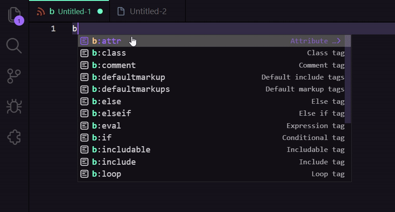

# Blogger Syntax 

Visual Studio extension that adds code snippets and autocomplete suggestions that correspond to the syntax of Blogger.

## Installation

- Open the Extensions sidebar in VS Code
- Search for Blogger Syntax
- Click Install

## Special Thanks

- BloggerCode: [bloggercode-blogconnexion](https://bloggercode-blogconnexion.blogspot.com/)