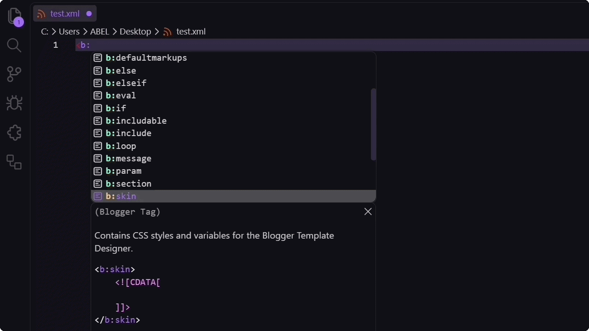

# Blogger Syntax

VS Code extension adding IntelliSense and snippets for the Blogger (Blogspot) XML template syntax.



---

## Features

**Autocomplete**
- Context-aware completions for all Blogger `data:*` objects (`data:blog`, `data:view`, `data:messages`, `data:skin`, `data:widget`, `data:widgets`, `data:post`, `data:posts`, etc.) and their nested properties (e.g. `data:blog.locale.country`, `data:post.author.authorPhoto.width`, `data:view.archive.year`).
- Data type badges (`String`, `Boolean`, `URL`, `Image`, `Date`, `Number`, `Message`, `Object`, `Array`) with inline documentation.

**Hover documentation**
- Tooltips for all Blogger tags (`<b:if>`, `<b:loop>`, `<b:widget>`, `<b:eval>`, `<b:param>`, etc.).
- `expr:*` attribute prefix hover support.
- Attribute documentation for Blogger tags (`cond`, `maxwidgets`, `locked`, `values`, `type`, `name`, `id`, `var`, `index`, etc.) with multiline tag context support. No false positives on standard HTML elements.

**Skin variables and groups**
- Suggestions for `description="..."` in `<Variable>` and `<Group>` tags with 250+ deduplicated Theme Designer variable descriptions.

**Widget and markup type autocomplete**
- Suggestions for `type="..."` in `<b:widget>` (25 widget types: `AdSense`, `Attribution`, `Blog`, `BlogArchive`, `Header`, `HTML`, `PopularPosts`, `Profile`, etc.) and `<b:defaultmarkup>` (27 types including `All` and `Common`).

**Snippets**
- 27 snippets with tab stops for all template tags, including `<b:param>`, `<b:switch>`, `<b:with>`, and Theme Designer tags.

**Configuration**
- Automatic suggestion triggering inside empty attributes can be toggled via VS Code Settings.

**Runtime**
- Runs on VS Code Desktop, VS Code for Web (`vscode.dev`, `github.dev`), GitHub Codespaces, Remote SSH, and Dev Containers with no runtime dependencies.

---

## Supported Languages

Active automatically for:
- **XML** (`.xml`)
- **Handlebars** (`.hbs`, `.handlebars`)

---

## Configuration

| Setting | Type | Default | Description |
| :--- | :--- | :--- | :--- |
| `bloggerSyntax.autoTriggerInEmptyAttributes` | `boolean` | `true` | Automatically trigger suggestions when moving the cursor inside empty `description=""` or `type=""` attributes. |

---

## Snippets

| Prefix | Tag | Description |
| :--- | :--- | :--- |
| `b:attr` | `<b:attr>` | Adds an attribute with value to the parent node. |
| `b:class` | `<b:class>` | Adds or appends CSS classes to the parent node. |
| `b:comment` | `<b:comment>` | Creates comments toggleable in rendering. |
| `b:defaultmarkups` | `<b:defaultmarkups>` | Default template markup includes container. |
| `b:defaultmarkup` | `<b:defaultmarkup>` | Default markup includes for a widget type. |
| `b:eval` | `<b:eval>` | Evaluates an expression and outputs the result. |
| `b:if` | `<b:if>` | Conditional rendering block. |
| `b:elseif` | `<b:elseif>` | Alternative conditional branch. |
| `b:else` | `<b:else/>` | Fallback branch for a conditional block. |
| `b:includable` | `<b:includable>` | Defines a reusable template section. |
| `b:include` | `<b:include>` | Renders an includable section. |
| `b:loop` | `<b:loop>` | Iterates through array data elements. |
| `b:message` | `<b:message>` | Formats a localized Blogger UI message. |
| `b:param` | `<b:param>` | Passes a parameter value to a parent `<b:message>` tag. |
| `b:section` | `<b:section>` | Defines a layout section containing widgets. |
| `b:skin` | `<b:skin>` | Theme styles and variables for Template Designer. |
| `b:template-skin` | `<b:template-skin>` | Layout mode CSS styles. |
| `Group` | `<Group>` | Groups variables in the Template Designer. |
| `Variable` | `<Variable>` | Customization options for Template Designer. |
| `b:switch` | `<b:switch>` | Evaluates an expression and matches branches. |
| `b:case` | `<b:case>` | Case branch of a switch evaluation. |
| `b:default` | `<b:default>` | Default case branch of a switch evaluation. |
| `b:tag` | `<b:tag>` | Dynamically generates any HTML tag. |
| `b:widget` | `<b:widget>` | Defines a Blogger widget component. |
| `b:widget-settings` | `<b:widget-settings>` | Widget settings configuration list. |
| `b:widget-setting` | `<b:widget-setting>` | Single widget setting key-value pair. |
| `b:with` | `<b:with>` | Binds an expression to a local scoped variable. |

---

## Development

### Requirements
- [Node.js](https://nodejs.org/) >= 20
- [pnpm](https://pnpm.io/) >= 9

### Setup

```bash
git clone https://github.com/zkreations/blogger-syntax.git
cd blogger-syntax
pnpm install
```

### Scripts

```bash
pnpm test          # Run unit tests
pnpm run lint      # Run linter
pnpm run typecheck # Type check
pnpm run build     # Build bundle
pnpm run watch     # Watch mode during development
```

---

## Credits

- BloggerCode (orbiona) for comprehensive Blogger syntax references.

---

## License

[MIT](LICENSE)
